% 自動微分で遊ぼう
% @rydotyosh / Ryogo Yoshimura
% 2016.07.23


# 自己紹介

- なまえ
  @rydotyosh  / Ryogo Yoshimura
- しゅみ
  幾何学, 微分, プログラミング
- おしごと
  CAD/CAM やさん


# CAD/CAM

- <ruby>CAD<rt>computer aided design</rt></ruby>: 機械部品とかをモデリングする
- <ruby>CAM<rt>computer aided machining</rt></ruby>: 工作機械の最適な動作を計算する
- 曲面とか曲線とか微分とか出てくる

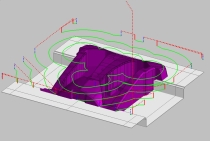 

<div class="cite">
https://www.cgsys.co.jp/g/products/CAM-TOOL/3dcam_cl.htm
</div>


# 自動微分とは

- プログラムで書かれた関数から
  合成関数の微分規則を使って
  導関数の値を求める方法
- `#`とは


# もくじ

- 微分
    - 合成関数の微分
- プログラムで書かれた関数
- 自動微分
    - ボトムアップ型自動微分
    - トップダウン型自動微分
- Adept の紹介
- Boost と組み合わせてみる
- 感想


# 微分

- 関数 $f(x)$ の入力 $x$ を少し変えたときに
  出力がどれぐらい変わるか
- <ruby>傾き<rt>slope</rt></ruby> $\frac{df}{dx} = \lim_{h \to 0} \frac{f(x+h) - f(x)}{h}$

 

<div class="cite">
https://en.wikipedia.org/wiki/Derivative
</div>


# 偏微分

- 多変数関数 $f(x_0, ..., x_n)$ のときに
  1つの変数 $x_i$ を選んで変化させ
  他の変数は固定する
- <ruby>勾配<rt>gradient</rt></ruby> は各変数での偏導関数を並べたもの


<div class="cite">
http://en.wikipedia.org/wiki/Gradient
</div>


# 微分, 導関数

- <ruby>微分<rt>differentiation</rt></ruby>:
  元の関数 $f$ から 傾きを表す関数 $\frac{df}{dx}$ を求める操作
- <ruby>導関数<rt>derivative</rt></ruby>:
  元の関数 $f$ の傾きを表す関数 $\frac{df}{dx}$


# 利用場面

- シミュレーション, 最適化, 機械学習, ..., etc.
  ある点にいるときに勾配を求めて
  誤差が少ないほうに進む
- モデルを表す関数を書いたら
  導関数はコンピュータで自動的に求めてほしい


# コンピュータで計算する微分

- <ruby>数式微分<rt>symbolic differentiation</rt></ruby>
  関数に数式処理をして導関数を求める
  計算に比較的時間がかかる
- <ruby>数値微分<rt>numerical differentiation</rt></ruby>
  関数の値を数値的に求めて導関数の値を近似する
  浮動小数点誤差の影響が大きい
- <ruby>自動微分<rt>automatic differentiation</rt></ruby>
  数式微分と数値微分の中間的な方法
  関数の値と導関数の値を求める
  合成関数の微分規則を使う


# 微分の記法

- ラグランジュの記法
  $f^\prime$
- ライプニッツの記法
  $\frac{df}{dx}$
  $\frac{\partial f}{\partial x}$ (偏導関数)
- 合成関数の微分規則を書くのにべんりなため
  以降では主にライプニッツの記法($\frac{df}{dx}$)を使う


# 合成関数

- $f(g(x))$
- 例
  $f(g)=g^2$
  $g(x)=x+3$
  $f(g(x)) = (x+3)^2$


# 合成関数の微分

- $f(g(x))$
  $\frac{df}{dx} = \frac{df}{dg} \cdot \frac{dg}{dx}$
- それぞれの導関数の積になる
- 見た目がすごく約分っぽい
- もっと合成すると積がつながっていく
- $f(g(h(x)))$
  $\frac{df}{dx} = \frac{df}{dg} \cdot \frac{dg}{dh} \cdot \frac{dh}{dx}$
- <ruby>連鎖律<rt>chain rule</rt></ruby>という


# 例 | 合成関数の微分

- $f(g(x))$
  $\frac{df}{dx} = \frac{df}{dg} \cdot \frac{dg}{dx}$
- 例
$$
\begin{array}{ll}
  f(g)=g^2,                   & \class{mathbg-r}{\frac{df}{dg}(g)=2g} \\
  \class{mathbg-y}{g(x)=x+3}, & \class{mathbg-g}{\frac{dg}{dx}(x)=1} \\
\end{array} \\
\begin{align}
  \textstyle \frac{df}{dx}(x)
    & = \textstyle \class{mathbg-r}{\frac{df}{dg}(\class{mathbg-y}{g(x)})} \cdot \class{mathbg-g}{\frac{dg}{dx}(x)} \\
    & = \class{mathbg-r}{(2 \class{mathbg-y}{(x+3)})} \cdot \class{mathbg-g}{(1)} \\
    & = 2x + 6 \\
\end{align}
$$


# 多変数 | 合成関数の微分

- $f(g(x), h(x))$
  $\frac{df}{dx} = \frac{\partial f}{\partial g} \cdot \frac{dg}{dx} + \frac{\partial f}{\partial h} \cdot \frac{dh}{dx}$
- 偏導関数のそれぞれの変数について和になる
- 変数の個所に代入されている関数について積になる
- もっと多変数でも同様
- $f(g(x, y), h(x, y), u(x, y))$
  $\frac{\partial f}{\partial x} = \frac{\partial f}{\partial g} \cdot \frac{\partial g}{\partial x} + \frac{\partial f}{\partial h} \cdot \frac{\partial h}{\partial x} + \frac{\partial f}{\partial u} \cdot \frac{\partial u}{\partial x}$
  $\frac{\partial f}{\partial y} = \frac{\partial f}{\partial g} \cdot \frac{\partial g}{\partial y} + \frac{\partial f}{\partial h} \cdot \frac{\partial h}{\partial y} + \frac{\partial f}{\partial u} \cdot \frac{\partial u}{\partial y}$


# 多変数の例 | 合成関数の微分

- $f(g(x), h(x))$
- 例
$$
\begin{array}{ll}
  f(g, h)=g \cdot h,                & \class{mathbg-r}{\frac{\partial f}{\partial g}(g, h)=h},
                                    & \class{mathbg-c}{\frac{\partial f}{\partial h}(g, h)=g} \\
  \class{mathbg-y}{g(x)=x+3},       & \class{mathbg-g}{\frac{dg}{dx}(x)=1} \\
  \class{mathbg-b}{h(x)=4 \cdot x}, & \class{mathbg-m}{\frac{dh}{dx}(x)=4} \\
\end{array} \\
\begin{align}
  \textstyle \frac{df}{dx}(x)
    & = \textstyle \class{mathbg-r}{\frac{\partial f}{\partial g}(\class{mathbg-y}{g(x)}, \class{mathbg-b}{h(x)})} \cdot \class{mathbg-g}{\frac{dg}{dx}(x)} + \\
    & \hspace{3ex} \textstyle \class{mathbg-c}{\frac{\partial f}{\partial h}(\class{mathbg-y}{g(x)}, \class{mathbg-b}{h(x)})} \cdot \class{mathbg-m}{\frac{dh}{dx}(x)} \\
    & = \class{mathbg-b}{(4 \cdot x)} \cdot \class{mathbg-g}{(1)} + \class{mathbg-y}{(x+3)} \cdot \class{mathbg-m}{(4)} \\
    & = 8x + 12 \\
\end{align}
$$


# 計算グラフ

- 合成関数の計算過程を表した <ruby>閉路のない有向グラフ<rt>directed acyclic graph</rt></ruby>
- 下から上に向かって計算が進む
- 変数・定数は節, 引数は辺 に対応
- 例 $y = (x+3) \cdot (4 \cdot x)$

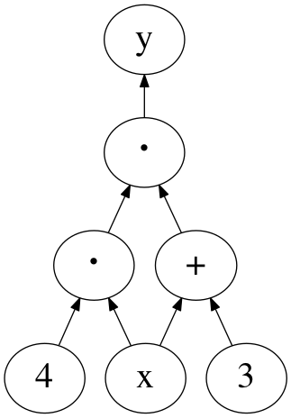


# 微分 | 計算グラフ

- $f(g(x))$ とその導関数
- 縦につながっているものは積で計算
  $\frac{df}{dx} = \frac{df}{dg} \cdot \frac{dg}{dx}$
- 鎖線は導関数を計算したもので
  直接つながっているわけではない

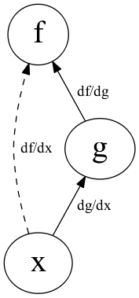


# 多変数 | 計算グラフ

- $f(g(x),h(x))$ とその導関数
- 縦につながっているものは積で計算
- 横に並んでいるものは和で計算
  $\frac{df}{dx} = \frac{\partial f}{\partial g} \cdot \frac{dg}{dx} + \frac{\partial f}{\partial h} \cdot \frac{dh}{dx}$


# プログラムで書かれた関数

- 入力に対して出力が決まる
- 以降では `double` の配列(的なもの)を
  入出力と考える

```cpp
std::vector<double> f(
    const std::vector<double> &x );
```

- 四則演算 ( `+`, `-`, `*`, `/` )
- 初等関数 ( `exp`, `sin`, `cos`, ... )
    - 微分できる関数を
      1つの単位として扱ってもよい
- 条件演算子/制御文 ( `?:`, `if`, `for`, ... )
- 再代入


# 制御文 | プログラムで書かれた関数

- 制御文があると
  場合によって計算過程が変わる
- 実際に通った計算過程をもとに微分する

```cpp
if ( x > 0 )
  y = x;
else
  y = -x;
```

- 上の例は `>` にするか `>=` にするかで
  `x == 0` のときの `y` の値は同じだが
  導関数の値は異なってくる


# 再代入 | プログラムで書かれた関数

- 再代入は計算過程上では別の変数と考える
- 実際にはメモリ上に保存しておかなくて
  よい場合もある
- <strike>`const`教では背信行為</strike>


# 自動微分

- プログラムで書かれた関数を
  四則演算, 初等関数 を合成した関数とみなす
- 合成関数の微分を適用
- 自動微分用の型を作り
  四則演算, 初等関数 をオーバーロード
- 2種類の方法
    - ボトムアップ型自動微分
    - トップダウン型自動微分


# 概要 1/2 | ボトムアップ型

- 計算グラフを下からたどるのでボトムアップ
    - $f(g(h(x)))$ があったときに
      $\frac{dh}{dx}$, $\frac{dg}{dx}$, $\frac{df}{dx}$ と順に求まるイメージ

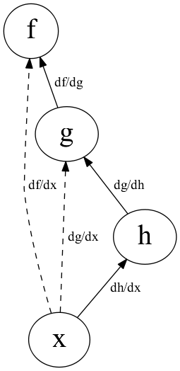


# 概要 2/2 | ボトムアップ型

- 微分する入力変数を1個指定する
- 関数の値と導関数の値を同時に計算していく
- 最終的に関数の値と
  指定した変数での導関数の値が求まる


# オーバーロード | ボトムアップ型

- 関数の値と導関数の値を $[ f, \frac{df}{dx} ]$ と括弧表記する
- 和 $[ f, \frac{df}{dx} ] +     [ g, \frac{dg}{dx} ] = [ f +     g, \frac{df}{dx} + \frac{dg}{dx} ]$
- 積 $[ f, \frac{df}{dx} ] \cdot [ g, \frac{dg}{dx} ] = [ f \cdot g, g \cdot \frac{df}{dx} + f \cdot \frac{dg}{dx} ]$


# 計算グラフ | ボトムアップ型

- 例
  $y = (x+a) \cdot (b \cdot x)$
  $x = 2, \hspace{1ex} a = 3, \hspace{1ex} b = 4$


# 例 1/6 | ボトムアップ型

- $y = (x+a) \cdot (b \cdot x)$
  $x = 2, \hspace{1ex} a = 3, \hspace{1ex} b = 4$
- 微分する変数: $x$
  導関数の値は $1$
  $x \to [2,1]$
- 定数: $a$, $b$
  導関数の値は $0$
  $a \to [3,0]$, $b \to [4,0]$


# 例 2/6 | ボトムアップ型

- $y = (\class{mathbg-r}{x}+\class{mathbg-g}{a}) \cdot (\class{mathbg-y}{b} \cdot \class{mathbg-r}{x})$
  $\class{mathbg-r}{x = 2}, \hspace{1ex} \class{mathbg-g}{a = 3}, \hspace{1ex} \class{mathbg-y}{b = 4}$
  $\class{mathbg-r}{x \to [2,1]}, \hspace{1ex} \class{mathbg-g}{a \to [3,0]}, \hspace{1ex} \class{mathbg-y}{b \to [4,0]}$
$$
\begin{align}
  \textstyle [y, \frac{dy}{dx}]
    & = (\class{mathbg-r}{[2,1]}+\class{mathbg-g}{[3,0]}) \cdot (\class{mathbg-y}{[4,0]}\cdot\class{mathbg-r}{[2,1]}) \\
\end{align}
$$
- 関数の値と導関数の値を代入


# 例 3/6 | ボトムアップ型

- $y = (x+a) \cdot (b \cdot x)$
  $x = 2, \hspace{1ex} a = 3, \hspace{1ex} b = 4$
$$
\begin{align}
  \textstyle [y, \frac{dy}{dx}]
    & = ([\class{mathbg-r}{2},\class{mathbg-y}{1}]+[\class{mathbg-b}{3},\class{mathbg-g}{0}]) \cdot ([4,0]\cdot[2,1]) \\
    & = [\class{mathbg-r}{2}+\class{mathbg-b}{3},\class{mathbg-y}{1}+\class{mathbg-g}{0}] \cdot ([4,0]\cdot[2,1]) \\
    & = [5,1] \cdot ([4,0]\cdot[2,1]) \\
\end{align}
$$
- 和を適用
  $[ \class{mathbg-r}{f}, \class{mathbg-y}{\frac{df}{dx}} ] +     [ \class{mathbg-b}{g}, \class{mathbg-g}{\frac{dg}{dx}} ] = [ \class{mathbg-r}{f} +     \class{mathbg-b}{g}, \class{mathbg-y}{\frac{df}{dx}} + \class{mathbg-g}{\frac{dg}{dx}} ]$


# 例 4/6 | ボトムアップ型

- $y = (x+a) \cdot (b \cdot x)$
  $x = 2, \hspace{1ex} a = 3, \hspace{1ex} b = 4$
$$
\begin{align}
  \textstyle [y, \frac{dy}{dx}]
    & = ([2,1]+[3,0]) \cdot ([4,0]\cdot[2,1]) \\
    & = [5,1] \cdot ([\class{mathbg-r}{4},\class{mathbg-y}{0}]\cdot[\class{mathbg-b}{2},\class{mathbg-g}{1}]) \\
    & = [5,1] \cdot [\class{mathbg-r}{4} \cdot \class{mathbg-b}{2}, \class{mathbg-b}{2} \cdot \class{mathbg-y}{0} + \class{mathbg-r}{4} \cdot \class{mathbg-g}{1}] \\
    & = [5,1] \cdot [8,4] \\
\end{align}
$$
- 積を適用
  $[ \class{mathbg-r}{f}, \class{mathbg-y}{\frac{df}{dx}} ] \cdot [ \class{mathbg-b}{g}, \class{mathbg-g}{\frac{dg}{dx}} ] = [ \class{mathbg-r}{f} \cdot \class{mathbg-b}{g}, \class{mathbg-b}{g} \cdot \class{mathbg-y}{\frac{df}{dx}} + \class{mathbg-r}{f} \cdot \class{mathbg-g}{\frac{dg}{dx}} ]$


# 例 5/6 | ボトムアップ型

- $y = (x+a) \cdot (b \cdot x)$
  $x = 2, \hspace{1ex} a = 3, \hspace{1ex} b = 4$
$$
\begin{align}
  \textstyle [y, \frac{dy}{dx}]
    & = ([2,1]+[3,0]) \cdot ([4,0]\cdot[2,1]) \\
    & = [5,1] \cdot ([4,0]\cdot[2,1]) \\
    & = [\class{mathbg-r}{5},\class{mathbg-y}{1}] \cdot [\class{mathbg-b}{8},\class{mathbg-g}{4}] \\
    & = [\class{mathbg-r}{5} \cdot \class{mathbg-b}{8}, \class{mathbg-b}{8} \cdot \class{mathbg-y}{1} + \class{mathbg-r}{5} \cdot \class{mathbg-g}{4}] \\
    & = [40,28] \\
\end{align}
$$
- 積を適用
  $[ \class{mathbg-r}{f}, \class{mathbg-y}{\frac{df}{dx}} ] \cdot [ \class{mathbg-b}{g}, \class{mathbg-g}{\frac{dg}{dx}} ] = [ \class{mathbg-r}{f} \cdot \class{mathbg-b}{g}, \class{mathbg-b}{g} \cdot \class{mathbg-y}{\frac{df}{dx}} + \class{mathbg-r}{f} \cdot \class{mathbg-g}{\frac{dg}{dx}} ]$


# 例 6/6 | ボトムアップ型

- $y = (x+a) \cdot (b \cdot x)$
  $x = 2, \hspace{1ex} a = 3, \hspace{1ex} b = 4$
$$
\begin{align}
  \textstyle [y, \frac{dy}{dx}]
    & = ([2,1]+[3,0]) \cdot ([4,0]\cdot[2,1]) \\
    & = [5,1] \cdot ([4,0]\cdot[2,1]) \\
    & = [5,1] \cdot [8,4] \\
    & = [40,28] \\
\end{align}
$$
- できあがり
- cf. $\frac{dy}{dx}=8x+12=28$


# 実装例 | ボトムアップ型

```cpp
#include <iostream>
struct ad { double x, dx; };
ad operator+( const ad &f, const ad &g ) {
  return ad{ f.x + g.x, f.dx + g.dx };
}
ad operator*( const ad &f, const ad &g ) {
  return ad{ f.x * g.x, g.x * f.dx + f.x * g.dx };
}
int main() {
  ad x{ 2, 1 }, a{ 3, 0 }, b{ 4, 0 };
  ad y = ( x + a ) * ( b * x );
  std::cout << y.x << "," <<
               y.dx << std::endl;
}
// --> 40,28
```


# 1変数まとめ | ボトムアップ型

- 1変数の場合はすごくかんたん
  あとは対応するオーバーロードを増やすだけ
- 多変数の場合?


# 多変数 | ボトムアップ型

- 多変数の場合 $f(x_0, x_1, ..., x_n)$
- それぞれの変数で偏導関数の値を $1$ にして毎回計算する
  $[f, \frac{\partial f}{\partial x_0}], [f, \frac{\partial f}{\partial x_1}], ..., [f, \frac{\partial f}{\partial x_n}]$
- もしくは偏導関数の値を並べて同時に計算する
  $[f, \frac{\partial f}{\partial x_0}, \frac{\partial f}{\partial x_1}, ..., \frac{\partial f}{\partial x_n}]$
- どちらも無駄な計算が多い
- 入力変数→少, 出力変数→多 というケースでは有効
    - あんまりそういうケースはない?
- そこでトップダウン型自動微分


# 概要 1/3 | トップダウン型

- 計算グラフを上からたどるのでトップダウン
    - $f(g(h(x)))$ があったときに
      $\frac{df}{dg}$, $\frac{df}{dh}$, $\frac{df}{dx}$ の順 (左下図)
    - cf. ボトムアップの場合は
      $\frac{dh}{dx}$, $\frac{dg}{dx}$, $\frac{df}{dx}$ の順 (右下図)

<span style="display: block; margin: 0 auto; text-align:center;" >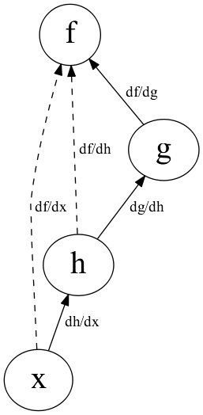 </span>


# 概要 2/3 | トップダウン型

- 微分する出力変数を1個指定する
- 計算過程を全部覚えておく
- 関数の値を求め終わったら計算過程を逆にたどる
- 最終的に関数の値と
  すべての変数での偏導関数の値が求まる

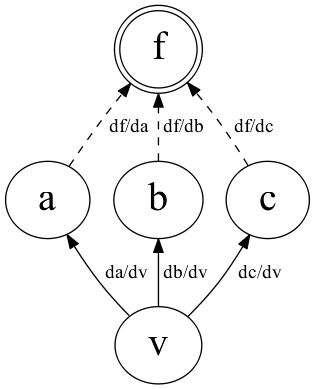


# 概要 3/3 | トップダウン型

- 下図で $v$ はどこで何個使われているかは分からない
- $\frac{\partial f}{\partial v}$ は横に並んでいるので和を取ればよい
- 各変数 $v_i$ に $\frac{\partial f}{\partial v_i}$ を覚えておく領域をとっておき
  $v_i$ が使われたらその領域に加算する


# 計算グラフ | トップダウン型

- 例
  $y = (x+a) \cdot (b \cdot x)$
  $x = 2, \hspace{1ex} a = 3, \hspace{1ex} b = 4$


# 例 1/11 | トップダウン型

- $y = (x+a) \cdot (b \cdot x)$
  $x = 2, \hspace{1ex} a = 3, \hspace{1ex} b = 4$
- 微分する変数: $y$
  導関数の値を $1$ とする ($\frac{\partial y}{\partial y}=1$)
- 各演算に中間変数名をふる
  $c = x + a$
  $d = b \cdot x$
  $e = c \cdot d$
  $y = e$
- 導関数の値を覚えておく領域を $S(v)$ で参照する


# 例 2/11 | トップダウン型

- $y = (x+a) \cdot (b \cdot x)$
  $x = 2, \hspace{1ex} a = 3, \hspace{1ex} b = 4$
  $c = 5, \hspace{1ex} d = 8, \hspace{1ex} e = 40$
  $y = 40$
- 関数の値を全部計算


# 例 3/11 | トップダウン型

- $y = (x+a) \cdot (b \cdot x)$
  $x = 2, \hspace{1ex} a = 3, \hspace{1ex} b = 4$
  $S(y) \leftarrow 1$
  $S(a), ..., S(e) \leftarrow 0$
- 導関数の値を初期化


# 例 4/11 | トップダウン型

- $y = (x+a) \cdot (b \cdot x)$
  $x = 2, \hspace{1ex} a = 3, \hspace{1ex} b = 4$
  $S(y) = 1$
  $S(e) \leftarrow S(e) + S(y) \cdot \frac{\partial y}{\partial e} = 0 + 1 \cdot 1 = 1$
- $e \leftarrow y$ を計算


# 例 5/11 | トップダウン型

- $y = (x+a) \cdot (b \cdot x)$
  $x = 2, \hspace{1ex} a = 3, \hspace{1ex} b = 4$
  $S(y) = 1$
  $S(e) = 1$
  $S(d) \leftarrow S(d) + S(e) \cdot \frac{\partial e}{\partial d} = 0 + 1 \cdot 5 = 5$
- $d \leftarrow e$ を計算


# 例 6/11 | トップダウン型

- $y = (x+a) \cdot (b \cdot x)$
  $x = 2, \hspace{1ex} a = 3, \hspace{1ex} b = 4$
  $S(y) = 1$
  $S(e) = 1$
  $S(d) = 5$
  $S(c) \leftarrow S(c) + S(e) \cdot \frac{\partial e}{\partial c} = 0 + 1 \cdot 8 = 8$
- $c \leftarrow e$ を計算


# 例 7/11 | トップダウン型

- $y = (x+a) \cdot (b \cdot x)$
  $x = 2, \hspace{1ex} a = 3, \hspace{1ex} b = 4$
  $S(y) = 1$
  $S(e) = 1$
  $S(d) = 5$
  $S(c) = 8$
  $S(b) \leftarrow S(b) + S(d) \cdot \frac{\partial d}{\partial b} = 0 + 5 \cdot 2 = 10$
- $b \leftarrow d$ を計算


# 例 8/11 | トップダウン型

- $y = (x+a) \cdot (b \cdot x)$
  $x = 2, \hspace{1ex} a = 3, \hspace{1ex} b = 4$
  $S(y) = 1$
  $S(e) = 1$
  $S(d) = 5$
  $S(c) = 8$
  $S(b) = 10$
  $S(x) \leftarrow S(x) + S(d) \cdot \frac{\partial d}{\partial x} = 0 + 5 \cdot 4 = 20$
- $x \leftarrow d$ を計算


# 例 9/11 | トップダウン型

- $y = (x+a) \cdot (b \cdot x)$
  $x = 2, \hspace{1ex} a = 3, \hspace{1ex} b = 4$
  $S(y) = 1$
  $S(e) = 1$
  $S(d) = 5$
  $S(c) = 8$
  $S(b) = 10$
  $S(x) = 20$
  $S(x) \leftarrow S(x) + S(c) \cdot \frac{\partial c}{\partial x} = 20 + 8 \cdot 1 = 28$
- $x \leftarrow c$ を計算


# 例 10/11 | トップダウン型

- $y = (x+a) \cdot (b \cdot x)$
  $x = 2, \hspace{1ex} a = 3, \hspace{1ex} b = 4$
  $S(y) = 1$
  $S(e) = 1$
  $S(d) = 5$
  $S(c) = 8$
  $S(b) = 10$
  $S(x) = 28$
  $S(a) \leftarrow S(a) + S(c) \cdot \frac{\partial c}{\partial a} = 0 + 8 \cdot 1 = 8$
- $a \leftarrow c$ を計算


# 例 11/11 | トップダウン型

- $y = (x+a) \cdot (b \cdot x)$
  $x = 2, \hspace{1ex} a = 3, \hspace{1ex} b = 4$
  $S(y) = \frac{\partial y}{\partial y} = 1$
  $S(e) = \frac{\partial y}{\partial e} = 1$
  $S(d) = \frac{\partial y}{\partial d} = 5$
  $S(c) = \frac{\partial y}{\partial c} = 8$
  $S(b) = \frac{\partial y}{\partial b} = 10$
  $S(x) = \frac{\partial y}{\partial x} = 28$
  $S(a) = \frac{\partial y}{\partial a} = 8$
- できあがり


# まとめ | トップダウン型

- 多変数関数の偏導関数がぜんぶ求まる
- 入力変数→多, 出力変数→少 というケースで有効
    - だいたいこれに当てはまると思う
- べんり
- 実装はちょっとめんどくさそう


# 自動微分ができるC++ライブラリ

- いろいろある
    - ADOL-C
    - CppAD
    - TensorFlow
    - Adept
- 今回は Adept を紹介


# Adept の紹介

- http://www.met.rdg.ac.uk/clouds/adept/
- あでぷと<sup>[要出典]</sup>
- <ruby>自動微分<rt>automatic differentiation</rt></ruby> を求めるライブラリ
    - 主にトップダウン型自動微分
- コードが短い (3000行ぐらい)
    - コメントがたくさん書いてある
- <ruby>式テンプレート<rt>expression template</rt></ruby> を使っている
- OpenMP 版もある
- Boost には入ってない


# 式テンプレート

- 自動微分用の型 `adept::adouble`
- オーバーロードで
  式を表す型 `adept::Expression` を返すようにする
- コンパイル時に計算し
  覚えておく必要のある中間変数を最小限にする


# 使ってみる

```cpp
#include <iostream>
#include "adept/adept.h"
int main() {
  adept::Stack stack;    // 導関数の情報を格納するオブジェクト
  adept::adouble x = 2;  // 入力変数
  stack.new_recording(); // アルゴリズムの記録を開始
  adept::adouble y =
    ( x + 3 ) * ( 4 * x ); // アルゴリズムを実行
  y.set_gradient( 1.0 );   // 出力変数の勾配を設定
  stack.reverse();         // トップダウン型自動微分を実行
  std::cout << y.value() << "," << // 出力変数の値
               x.get_gradient() << // 導関数の値
               std::endl;
}
// --> 40,28
```


# Boost と組み合わせてみる

※ 思いついた順

- special_functions
- odeint
- accumulators
- ublas


# Adept x Boost.special_functions

- 特殊関数
- C++1z で一部が std に入る
- std では `float`, `double`, `long double` だが
  boost では `template<class T>`


# Adept x Boost.special_functions

- なんかうまくいかない ><
    - 関数が足りない `ceil`, `floor`
    - numeric_limits
    - ETが邪魔 `T( ( cond ) ? z : -z )`
- 結局断念 ;;


# Adept x Boost.odeint

- 微分方程式
- `Value`, `Time` の型を `adept::adouble` にするとできる
- テンプレート力高い
- 微分仲間ということで あとでもうちょっと遊ぶ


# Adept x Boost.accumulators

- 統計処理
- `sum` はできる
- `median`, `min` はコンパイルエラー
- `mean` は通るがなぜか落ちる ><
- 結局断念 ;;


# Adept x Boost.ublas

- 行列
- できる
- テンプレート力高い


# Adept x Odeint

- 微分仲間ということで もうちょっと遊ぶ
- 物理現象の観測データ(ぽいもの)から
  シミュレーションの初期条件を推定してみる


# 天体の動き | Adept x Odeint

- 微分方程式
  $x^\prime = u, u^\prime = -\frac{mx}{(x^2+y^2)^{3/2}}$ 
  $y^\prime = v, v^\prime = -\frac{my}{(x^2+y^2)^{3/2}}$
- 初期条件
  座標 $x(0) = 3.0, \hspace{1ex} y(0) = 0.0$
  速度 $u(0) = 0.3, \hspace{1ex} v(0) = 0.2$
- 定数
  太陽の質量 $m = 1.0$


# 初期条件 | Adept x Odeint

```cpp
std::vector< double > init {
  /*x =*/ 3.0, /*y =*/ 0.0, // 座標
  /*u =*/ 0.3, /*v =*/ 0.2, // 速度
  /*m =*/ 1.0               // 太陽の質量
};
```


# 微分方程式 | Adept x Odeint

```cpp
template< class T >
std::vector< T > simulate( const std::vector< T > &init ) {
  using namespace boost::numeric;
  typedef std::array< T, 4 > state_t;
  state_t x0 { init[ 0 ], init[ 1 ], init[ 2 ], init[ 3 ] };
  T m = init[ 4 ];
  auto system = [&]( const state_t &x,
                     state_t &dxdt, T /*t*/ ) { // 微分方程式を書く
    dxdt[ 0 ] = x[ 2 ]; // u`
    dxdt[ 1 ] = x[ 3 ]; // v`
    T r2 = x[ 0 ] * x[ 0 ] + x[ 1 ] * x[ 1 ];
    T r3 = pow( r2, 3.0 / 2.0 ) * m;
    dxdt[ 2 ] = -x[ 0 ] / r3; // x`
    dxdt[ 3 ] = -x[ 1 ] / r3; // y`
  };
  ...
```


# 軌道を求める | Adept x Odeint

```cpp
template< class T >
std::vector< T > simulate( const std::vector< T > &init ) {
  ...
  auto stepper =
    odeint::controlled_runge_kutta<
      odeint::runge_kutta_dopri5< state_t, T > >();
  std::vector< T > orbit; // 軌道保存用
  auto observer = [&]( const state_t &x, T /*t*/ ) {
    orbit.push_back( x[ 0 ] );
    orbit.push_back( x[ 1 ] );
  };
  T t0 = 0.0, t1 = 15.0, dt = 0.1;
  odeint::integrate_const( // 軌道計算する
    stepper, system, x0, t0, t1, dt, observer );
  return orbit;
}
```


# 軌道を求める | Adept x Odeint

```cpp
int main() {
  std::vector< double > init {
    /*x =*/ 3.0, /*y =*/ 0.0, // 座標
    /*u =*/ 0.3, /*v =*/ 0.2, // 速度
    /*m =*/ 1.0               // 太陽の質量
  };
  std::vector< double > orbit = simulate( init );
  ...
```


# 軌道を求める | Adept x Odeint

- 普通に出ている

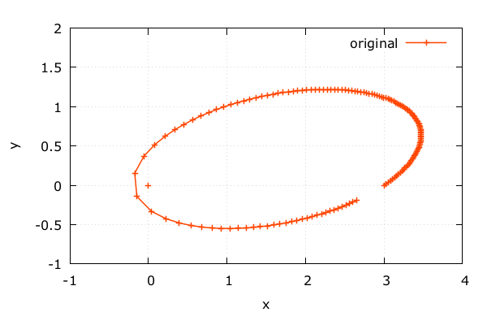

- ここまでは普通の `double`


# 観測データっぽく | Adept x Odeint

- ノイズを入れてみる
    - とりあえず正規分布

```cpp
  ...
  std::vector< double > observed = orbit;
  std::mt19937 gen( 0 );
  std::normal_distribution<> d( 0, 0.05 );
  for ( double &x : observed ) {
    x += d( gen );
  }
  ...
```


# 観測データっぽく | Adept x Odeint

- 乱れている

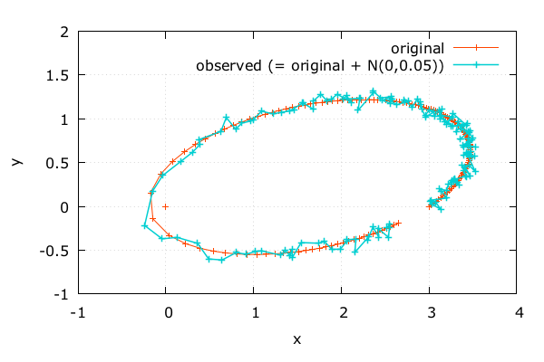

- これを観測データとする
- 以降では元の軌道は知らないことにする


# テキトーな初期条件 | Adept x Odeint

- 初期条件の 位置, 速度, 太陽の質量 を推定してみる
- 目分量でテキトーな初期条件を入れる

```cpp
  ...
  std::vector< double > init {
    /*x =*/ observed[0], /*y =*/ observed[1],
    /*u =*/ 0.4, /*v =*/ 0.3,
    /*m =*/ 0.8
  };
  ...
```


# テキトーな初期条件 | Adept x Odeint

- テキトーなのでずれている

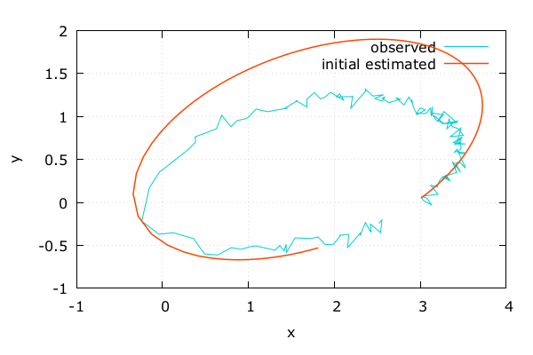


# 誤差 | Adept x Odeint

- とりあえず二乗平均

```cpp
template< class T >
T error( const std::vector< T > &orbit,
         const std::vector< double > &observed ) {
  size_t n = orbit.size();
  T sum_sqr = 0.0;
  for ( size_t i = 0; i < n; ++i ) {
    T dv = orbit[ i ] - observed[ i ];
    sum_sqr += dv * dv;
  }
  return sum_sqr / n;
}
```


# 初期条件で微分 | Adept x Odeint

```cpp
  ...
  size_t dim = init.size();
  adept::Stack stack;
  std::vector< adept::adouble > init_( dim ); // 入力変数
  for ( size_t i = 0; i < dim; ++i )
    init_[ i ] = init[ i ];
  stack.new_recording();    // アルゴリズムの記録を開始
  std::vector< adept::adouble > orbit_ = simulate( init_ );
  adept::adouble err_ = error( orbit_, observed ); // 誤差値
  err_.set_gradient( 1.0 ); // 出力変数(誤差値)の勾配を設定
  stack.reverse();          // トップダウン型自動微分を実行
  std::vector< double > grad( dim );
  for ( size_t i = 0; i < dim; ++i  )
    grad[ i ] = init_[ i ].get_gradient(); // 偏導関数の値
  ...
```


# 初期条件を変化 | Adept x Odeint

- 偏導関数の値にしたがって
  誤差が小さくなる方へ初期条件を変化させる

```cpp
  ...
  adam( grad, init );
  ...
```

# Adam法 | Adept x Odeint

- 偏導関数の値をいい感じに調節してくれる

```cpp
struct adam {
  ...
  void operator()( const std::vector< double > &dx,
                   std::vector< double > &x ) {
    double t = static_cast<double>( ++k );
    for ( size_t i = 0; i < dim; ++i ) {
      m1[ i ] = beta1 * m1[ i ] + ( 1.0 - beta1 ) * dx[ i ];
      m2[ i ] = beta2 * m2[ i ] + ( 1.0 - beta2 ) * dx[ i ] * dx[ i ];
      double c1 = m1[ i ] / ( 1.0 - pow( beta1, t ) );
      double c2 = m2[ i ] / ( 1.0 - pow( beta2, t ) );
      x[ i ] -= alpha * c1 / ( sqrt( c2 ) + epsilon );
    }
  }
}
```

# 初期条件を変化 | Adept x Odeint

- 10000回やった結果


- いい感じな気がする


# 元の軌道と比較 | Adept x Odeint

- こっそり元の軌道を覗く

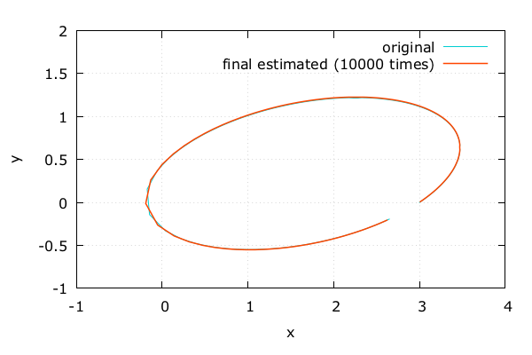

- あっている
- よかった

# 誤差の推移 | Adept x Odeint

- 5000回ぐらいで既にそこそこ収束してるっぽい

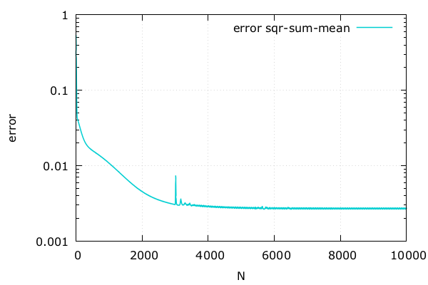


# 感想

- 自動微分はべんり
- 組み合わせるとそれぞれ地雷がある
- もうちょっと図示しやすい例にすればよかった


# 参考文献

- Robin J. Hogan. 2014. "Fast Reverse-Mode Automatic Differentiation using Expression Templates in C++". ACM Transactions on Mathematical Software, Vol. 40, No. 4, Article 26.
- 久保田光一, 伊理正夫. 1998. "アルゴリズムの自動微分と応用". コロナ社.
- επιστημη, 高橋 晶. 2014. "C++テンプレートテクニック 第2版". SBクリエイティブ.
- Diederik P. Kingma, Jimmy Lei Ba. 2015. "Adam: A Method for Stochastic Optimization". 3rd International Conference for Learning Representations.


# Q and A

- お手柔らかにお願いします ><

