% Boost.odeintで遊ぼう
% @rydotyosh / Ryogo Yoshimura
% 2015.05.30


# 自己紹介

- なまえ
@rydotyosh  / Ryogo Yoshimura
- しゅみ
幾何学, プログラミング
- おしごと
CAD/CAM やさん


# CAD/CAM

- <ruby>CAD<rt>computer aided design</rt></ruby>: 機械部品とかをモデリングする
- <ruby>CAM<rt>computer aided machining</rt></ruby>: 工作機械の動作方法を計算する
- 曲面とか曲線とか出てくる

 

<div class="cite">
https://www.cgsys.co.jp/g/products/CAM-TOOL/3dcam_cl.htm
</div>


# 曲面/曲線

- 微分とかよく出てくる
- 接線, 法線, 曲率など

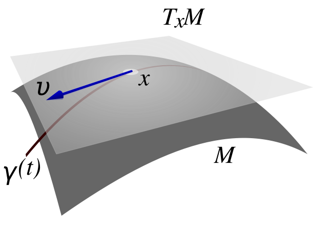 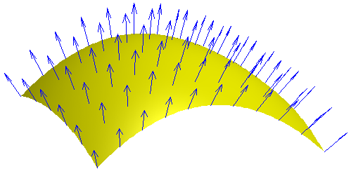

<div class="cite">
http://en.wikipedia.org/wiki/Tangent_space
http://en.wikipedia.org/wiki/Normal_(geometry)
</div>


# 曲面/曲線

- 微分方程式も出てくる
- 交線など


<div class="cite">
http://en.wikipedia.org/wiki/Cross_section_(geometry)
</div>


# Boost.odeint

- おでいんと<sup>[要出典]</sup>
- <ruby>常微分方程式<rt>ordinary differential equation</rt></ruby>の
<ruby>初期値問題<rt>initial value problem</rt></ruby>の
<ruby>数値近似<rt>numerical approximation</rt></ruby>を求めるライブラリ
- 普通の<ruby>積分<rt>integral</rt></ruby>の数値近似も OK
- Boost 1.53.0 から


<div class="cite">
http://www.boost.org/doc/libs/release/libs/numeric/odeint/doc/html/index.html
</div>


# Boost.odeint

- テンプレート力高い
- アダプタ
std.vector, array, complex,
boost.ublas, range, fusion, multiprecision, unit,
Eigen, Thrust(CUDA, OpenMP), VexCL(OpenCL)
- コンセプト
各種の解法をほぼ同じインタフェイスで使える
原理的に互換性のない解法もあるが


# 微分

- 傾き $\{x(t+\Delta t) - x(t)\}/\Delta t$
- 接線方向 $x^\prime(t)$
- 次の時点に行くときにどう進むか

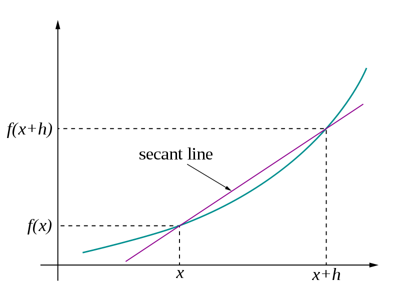 

<div class="cite">
http://en.wikipedia.org/wiki/Derivative
</div>


# 常微分方程式の初期値問題

- 最初の状態が分かっている
- 次の状態が予測できる
- 好きな時点での状態が分かるようにしたい

 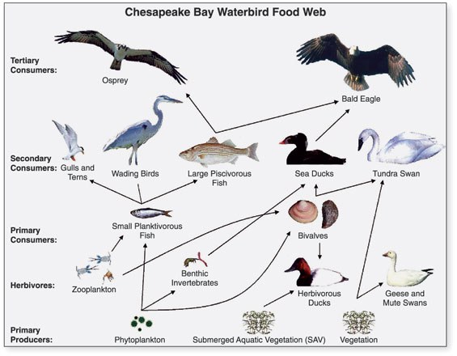

<div class="cite">
http://en.wikipedia.org/wiki/Galaxy
http://en.wikipedia.org/wiki/Food_chain
</div>


# 常微分方程式の初期値問題

- パラメータ, 時刻 $t$
- 未知関数, 状態 $x(t)$
- 最初の状態 $x(0)$ が分かっている
$$
x(0) = x_0
$$
- 次の状態が予測できる: $f$ が分かっている
$$
x^\prime(t) = f(x, t)
$$
- 好きな時点での状態: $x(t)$ を求めたい


# 常微分方程式の初期値問題

- 矢印の方向に流れていくようなイメージ


# 解析解と数値近似

- 解析解が求まってくれるとうれしい
- 普通は求めるのがとても難しい
- 数値計算で近似的に求める


# 解析解が求まってくれる例

- 微分方程式
$$
x^\prime(t) = x(t)
$$
- 初期条件
$$
x(0) = 1
$$

. . .

- 微分しても変わらないただ一つの関数

. . .

- 解析解
$$
x(t) = \exp(t) = e^t
$$
- 解析解を知らないふりして数値近似を求めてみる


# 数値近似の基本的な考え方

- <ruby>陽的<rt>explicit</rt></ruby> Euler 法
$$
x(t+\Delta t) \approx x(t) + x^\prime(t) \Delta t
$$
    1. ステップ $\Delta t$ を決める
    2. パラメータ $t$ で微分を求める
    3. パラメータ $t+\Delta t$ まで接線方向に進む
    4. パラメータを $t+\Delta t$ に進める
    5. 再帰


# 陽的 Euler 法

- 手計算


# 陽的 Euler 法

<div style="font-size:70%">
- $x^\prime(t)=x(t), \Delta t = 0.1$
- パラメータ $t = 0$
- 未知関数 $x(0) = 1$
- 微分 $x^\prime(0) = 1$
- 接線方向に進む $x(0.1) \approx x(0) + x^\prime(0) \Delta t = 1.1$
</div>


# 陽的 Euler 法

<div style="font-size:70%">
- $x^\prime(t)=x(t), \Delta t = 0.1$
- パラメータ $t = 0.1$
- 未知関数 $x(0.1) = 1.1$
- 微分 $x^\prime(0.1) = 1.1$
- 接線方向に進む $x(0.2) \approx x(0.1) + x^\prime(0.1) \Delta t = 1.21$
</div>

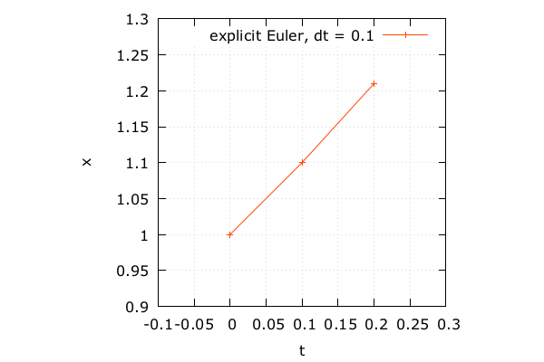


# 陽的 Euler 法

- 手計算2回やったら飽きる
- odeintに解いてもらう
- 状態の型を決める

```cpp
#include <iostream>
#include <array>
#include <boost/numeric/odeint.hpp>
namespace odeint = boost::numeric::odeint;
using state_type = std::array< double, 1 >;
```

# 陽的 Euler 法

- システム $x^\prime = f(x,t)$ を記述する

```cpp
auto exponential = [](
  const state_type &x,
  state_type &dxdt,
  const double /* t */
) {
  dxdt[ 0 ] = x[ 0 ]; // x`(t) = x(t)
};
```

# 陽的 Euler 法

- 初期値とか

```cpp
auto x0 = state_type{ 1.0 }; // 初期状態
auto t0 = 0.0; // 開始パラメータ
auto t1 = 1.0; // 終了パラメータ
auto dt = 0.1; // ステップ
```

# 陽的 Euler 法

- 求める

```cpp
auto stepper =
  odeint::euler< state_type >();
odeint::integrate_const(
  stepper, exponential, x0, t0, t1, dt,
  [](const state_type &x, const double t){
    std::cout << t << "\t"
              << x[ 0 ] << std::endl;
  } );
```


# 陽的 Euler 法

- できあがったものがこちらです
- 粗い気がする


# 陽的 Euler 法

- 実際粗い
- $\Delta t$ = 1.0e-1, 相対誤差 4.5e-2


# 陽的 Euler 法

- $\Delta t$ を細かくすると精度がよくなる
- $\Delta t$ = 1.0e-2, 相対誤差 4.9e-3


# 数値近似の基本的な考え方

- $\Delta t$ をもっと細かくすればいい気がする
- 精度1ケタ上げるのに10倍の計算が必要
- このままだとつらい

# Runge-Kutta 法

- 精度を改善したやつ

```cpp
auto stepper =
  odeint::runge_kutta4< state_type >();
odeint::integrate_const(
  stepper, exponential, x0, t0, t1, dt,
  [](const state_type &x, const double t){
    std::cout << t << "\t"
              << x[ 0 ] << std::endl;
  } );
```


# Runge-Kutta 法

- たいへんぴったり
- $\Delta t$ = 1.0e-1, 相対誤差 7.6e-7


# Runge-Kutta 法

- $\Delta t$ による誤差の変化
- Runge-Kutta 法ならなんとかしてくれる

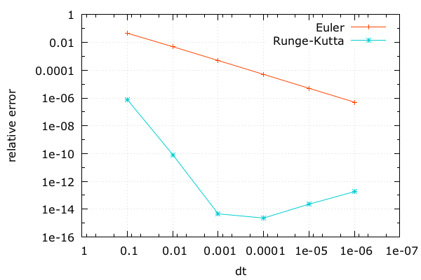


# いろんな数値近似

- odeintに用意されている解法


# いろんな数値近似

- たくさんある


# いろんな数値近似の考え方

- odeintに用意されている解法の考え方
- 次数
- 適応的
- 陽解法と陰解法
- 1ステップ法とマルチステップ法
- 数列加速


# 次数

- 未知関数 $x(t)$ を多項式展開
- 近似なので ある次数で項を打ち切っている
- 高次の項まで使えば精度がよくなる
- Euler 法 `odeint::euler`
1次近似
- Runge-Kutta 法 `odeint::runge_kutta4`
4次近似


# 適応的

- 近似値を求めたついでに
打ち切り誤差の推定値も求める
- Dormand–Prince 法 `odeint::runge_kutta_dopri5`
近似: 5次, 誤差: 4次
- Fehlberg 法 `odeint::runge_kutta_fehlberg78`
近似: 8次, 誤差: 7次
- $\Delta t$を自動的に補正できる
誤差が大きければ $\Delta t$ を小さく
誤差が小さければ $\Delta t$ を大きく


# 陽解法と陰解法

- <ruby>陽的<rt>explicit</rt></ruby> Euler 法  `odeint::euler`
$$
x(t+\Delta t) \approx x(t) + f(x, t) \Delta t
$$
- <ruby>陰的<rt>implicit</rt></ruby> Euler 法  `odeint::implicit_euler`
$$
x(t+\Delta t) \approx x(t) + f(x(t+\Delta t), t) \Delta t
$$
- 陰解法は両辺に$x(t+\Delta t)$が出てくる


# 陽解法と陰解法

- 陰解法は計算がめんどくさい
関数$f$をベクトル$x$で微分したもの (Jacobian) が必要になる
- 陰解法は安定性が高い
<ruby>硬い<rt>stiff</rt></ruby>微分方程式のときに使う
- Rosenbrock 法 `odeint::rosenbrock4`
高次の陰解法
さらに適応的な方法も使える


# 一般化 Runge-Kutta 法

- 次数, 適応的, 陽解法/陰解法を一般化する
$$
x(t+\Delta t) \approx x(t) + \Delta t \sum_{i=1}^s { b_i k_i },
$$ $$
k_i = f(x(t)+\sum_{j=1}^s {a_{ij} k_j}, t + c_i \Delta t), i = 1,...,s
$$
- $k$は予測値, $a, b$は予測値の重みづけ, $c$はパラメータの進め具合
- 係数 $a,b,c$によって解法の特性が決まる


# 一般化 Runge-Kutta 法

- Butcher tableau: 係数 $a,b,c$の一覧表
$$
 \begin{array}{c|cccc}
 c_1&a_{11}&a_{12}&\cdots&a_{1s} \\
 c_2&a_{21}&a_{22}&\cdots&a_{2s} \\
 \vdots&\vdots&\vdots&\ddots&\vdots \\
 c_s&a_{s1}&a_{s2}&\cdots &a_{ss} \\ \hline
 &b_1&b_2&\cdots &b_{s}
 \end{array}
$$


# 一般化 Runge-Kutta 法

- 陽的 Euler 法の Butcher tableau
$$
 \begin{array}{c|c}
 0& \\ \hline
  &1
 \end{array}
$$
- 陰的 Euler 法の Butcher tableau
$$
 \begin{array}{c|c}
 1&1 \\ \hline
  &1
 \end{array}
$$

# 一般化 Runge-Kutta 法

- (古典的) Runge-Kutta 法の Butcher tableau
$$
 \begin{array}{c|cccc}
 0&&&& \\
 1/2&1/2&&& \\
 1/2&0&1/2&& \\
 1&0&0&1& \\ \hline
  &1/6&1/3&1/3&1/6
 \end{array}
$$


# マルチステップ法

- 1ステップ法
$x(t)$をもとに$x(t+\Delta t)$を求める
Runge-Kutta 法の仲間はこれ
中間の値は求めているが、次のステップでは使っていない
- マルチステップ法
過去の数ステップをもとに次のステップを求める
ステップ数により次数が決まる
- Adams-Bashforth 法 `odeint::adams_bashforth`


# 数列加速

- マルチステップ法でステップを細かくしていくと精度が上がっていく
- 精度が上がっていく上がり方を数列加速を使って外挿する
- らしい
- ステップ長と次数が両方とも適応的
- Bulirsch-Stoer 法 `odeint::bulirsch_stoer`


# クロソイド曲線を書いてみる

- 直線と円弧のあいだをなめらかにつなぐ曲線
- 高速道路のインターチェンジなど


<div class="cite">
https://www.flickr.com/photos/jqpubliq/17180604744/
</div>


# クロソイド曲線を書いてみる

- 曲率半径 $R$
- 曲線長 $t$
- クロソイドパラメータ $A$
- クロソイド曲線
$$
R(t) \cdot t = A^2
$$
- 曲線長に反比例して半径が小さくなっていく


# クロソイド曲線を書いてみる

- 曲率半径の別表示, 角度 $\theta$
$$
\frac{1}{R}=\frac{d\theta}{d t}=A^2t
$$
- 手動で積分
$$
\theta = \frac{1}{2} A^2 t^2
$$
- ある曲線長の時点で曲線が進む方向が分かる
- 進む距離は単位長さ
- クロソイドパラメータ $A$ は省略して1とする


# クロソイド曲線を書いてみる

- 微分方程式
$$
x^\prime(t) = \cos \frac{t^2}{2}, y^\prime(t) = \sin \frac{t^2}{2}
$$
- 初期条件
$$
x(0)=0, y(0)=0
$$
- 右辺で状態を使っていない (普通の積分)
- かんたんそう
- 解析解は求まらない


# クロソイド曲線を書いてみる

- システムを記述する

```cpp
using state_type = std::array< double, 2 >;
auto clothoid = [](
  const state_type &/* x */,
  state_type &dxdt,
  const double t
) {
  dxdt[ 0 ] = cos( t * t / 2.0 ); // x`
  dxdt[ 1 ] = sin( t * t / 2.0 ); // y`
}
```


# クロソイド曲線を書いてみる

- デフォルトの積分関数を使ってみる

```cpp
auto x0 = state_type{ 0.0, 0.0 }; // 初期状態
auto t0 = 0.0;
auto t1 = 10.0;
auto dt = 0.01;
odeint::integrate(
  clothoid, x0, t0, t1, dt,
  []( const state_type &x, const double t ){
    std::cout << x[ 0 ] << "\t"
              << x[ 1 ] << std::endl;
  } );
```


# クロソイド曲線を書いてみる

- なんか粗い気がする

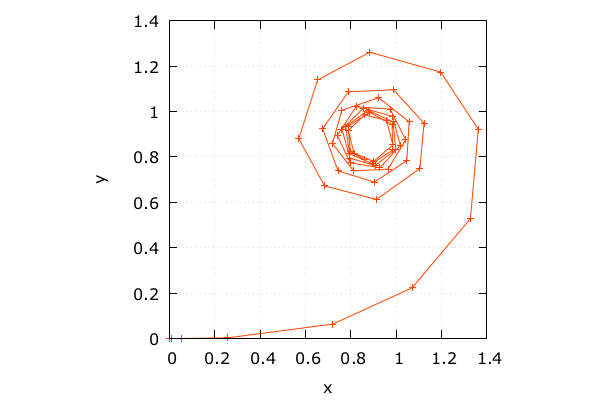


# クロソイド曲線を書いてみる

- `integrate` は `dt` を適応的に変化させている
- `t1` のときの結果が欲しければこれで十分
- 精度の良い計算もほしいが、曲線の軌跡もほしい
- `runge_kutta_dopri5` と `integrate_const` を使う
- 適応的にステップを変化させるラッパーを付ける必要がある


# クロソイド曲線を書いてみる

- 積分の設定を少し変更

```cpp
auto stepper =
  odeint::controlled_runge_kutta<
    odeint::runge_kutta_dopri5< state_type > >();
odeint::integrate_const(
  stepper, clothoid, x0, t0, t1, dt,
  []( const state_type &x, const double t ){
    std::cout << x[ 0 ] << "\t"
              << x[ 1 ] << std::endl;
  } );
```


# クロソイド曲線を書いてみる

- じょうずにできました

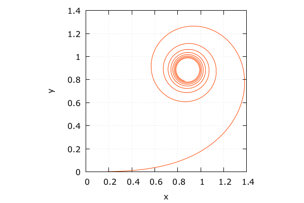


# 複素数表現にしてみる

- クロソイド曲線を複素数表現にしてみる

$$
z^\prime(t) = \exp \frac{it^2}{2}, i = \sqrt {-1}
$$


# 複素数表現にしてみる

- システム
- 型を `array` から `complex` に変更するだけ

```cpp
//using state_type = std::array< double, 2 >;
  using state_type = std::complex< double >;
  auto clothoid = [](
    const state_type &/* x */,
    state_type &dxdt,
    const double t
  ) {
//  dxdt[ 0 ] = cos( t * t / 2.0 );
//  dxdt[ 1 ] = sin( t * t / 2.0 );
    dxdt = std::exp( 1i * t * t / 2.0 );
  };
```


# 複素数表現にしてみる

- 積分

```cpp
  auto stepper =
    odeint::controlled_runge_kutta<
      odeint::runge_kutta_dopri5< state_type > >();
  odeint::integrate_const(
    stepper, clothoid, x0, t0, t1, dt,
    [](const state_type &x, const double t){
//    std::cout << x[ 0 ] << "\t"
//              << x[ 1 ] << std::endl;
      std::cout << x.real() << "\t"
                << x.imag() << std::endl;
    } );
```


# 複素数表現にしてみる

- だいたいいっしょ
- テンプレート力高い
むしろユーザコードの方が残念に感じられる


# 天体の動き

- 天体の動きを書いてみる
- 恒星(原点固定) と 惑星1個
- 惑星が原点付近を通るとﾋﾞｭﾝってなる
精度が下がりやすい


# 天体の動き

- 万有引力から運動方程式をそのまま書く
$$
m r^{\prime \prime} = -\frac{r}{|r|} G \frac{Mm}{|r|^2}
$$
- めんどくさいので係数を省略
$$
r^{\prime \prime} = -\frac{r}{|r|^3}
$$
- ベクトル $r$ を成分 $x, y$ に分解
$$
x^{\prime \prime} = -\frac{x}{(x^2+y^2)^{3/2}}, 
$$ $$
y^{\prime \prime} = -\frac{y}{(x^2+y^2)^{3/2}}
$$


# 天体の動き

- 2階微分が出てくる
- 速度成分 $u, v$ で置きなおす
$$
u = x^\prime, v = y^\prime
$$
- 微分すると
$$
u^\prime = x^{\prime \prime}, v^\prime = y^{\prime \prime}
$$


# 天体の動き

- 微分方程式
$$
x^\prime = u, u^\prime = -\frac{x}{(x^2+y^2)^{3/2}}, 
$$ $$
y^\prime = v, v^\prime = -\frac{y}{(x^2+y^2)^{3/2}}
$$
- 初期条件
$$
x(0) = 3, u(0) = 0.3,
$$ $$
y(0) = 0, v(0) = 0.2
$$
- 右辺で時刻 $t$ を使っていない


# 天体の動き

- システム

```cpp
using state_type = std::vector< double >;
auto astro = [](
  const state_type &x,
  state_type &dxdt,
  const double /*t*/
) {
  dxdt[ 0 ] = x[ 2 ]; // u`
  dxdt[ 1 ] = x[ 3 ]; // v`
  auto r2 = x[ 0 ] * x[ 0 ] + x[ 1 ] * x[ 1 ];
  auto r3 = pow( r2, 3.0 / 2.0 );
  dxdt[ 2 ] = -x[ 0 ] / r3; // x`
  dxdt[ 3 ] = -x[ 1 ] / r3; // y`
};
```


# 天体の動き

- 積分

```cpp
auto x0 = state_type{ 3.0, 0.0, 0.3, 0.2 };
auto t0 = 0.0, t1 = 16.0, dt = 0.01;
auto stepper =
  odeint::controlled_runge_kutta<
    odeint::runge_kutta_dopri5< state_type > >();
odeint::integrate_const(
  stepper, astro, x0, t0, t1, dt,
  [](const state_type &x, const double t){
    std::cout << t << "\t"
              << x[ 0 ] << "\t"
              << x[ 1 ] << std::endl;
  } );
```


# 天体の動き

- 実際楕円

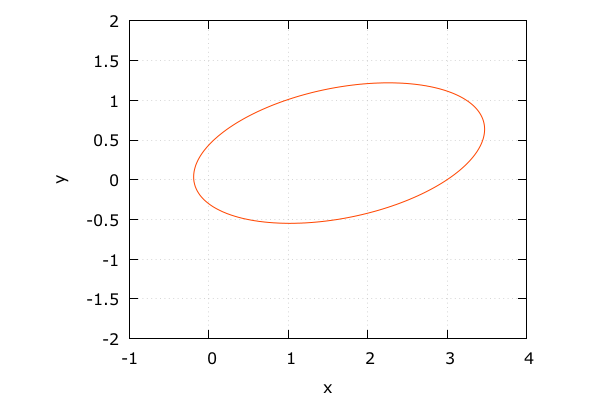


# 天体の動き

- $x, y$ 成分も見てみる
- よく追従できている

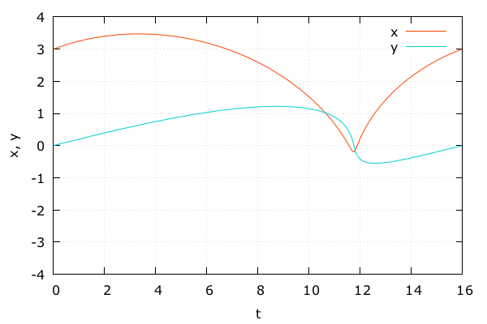


# 天体の動き

- $\Delta t$ を粗くしてみる `dt = 0.2`

```cpp
auto x0 = state_type{ 3.0, 0.0, 0.3, 0.2 };
auto t0 = 0.0, t1 = 16.0, dt = 0.2;
auto stepper =
  odeint::controlled_runge_kutta<
    odeint::runge_kutta_dopri5< state_type > >();
odeint::integrate_const(
  stepper, astro, x0, t0, t1, dt,
  [](const state_type &x, const double t){
    std::cout << t << "\t"
              << x[ 0 ] << "\t"
              << x[ 1 ] << std::endl;
  } );
```


# 天体の動き

- 描画は粗いがちゃんと戻ってきている
- 中身で適応的に計算しているおかげ


# 天体の動き

- よく追従できている


# 天体の動き

- 適応的方法で出力してみる `dt = 0.2`

```cpp
auto x0 = state_type{ 3.0, 0.0, 0.3, 0.2 };
auto t0 = 0.0, t1 = 16.0, dt = 0.2;
auto stepper =
  odeint::controlled_runge_kutta<
    odeint::runge_kutta_dopri5< state_type > >();
odeint::integrate_adaptive(
  stepper, astro, x0, t0, t1, dt,
  [](const state_type &x, const double t){
    std::cout << t << "\t"
              << x[ 0 ] << "\t"
              << x[ 1 ] << std::endl;
  } );
```

# 天体の動き

- 原点付近でがんばって計算していることがわかる

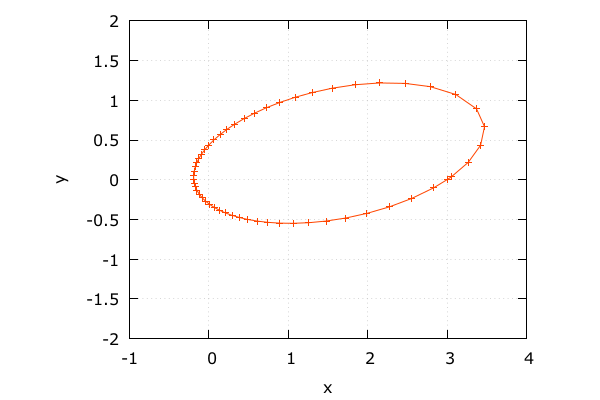


# 天体の動き

- よく追従できている


# 感想

- いろんな微分方程式の数値解法がのっていておもしろかった
正直 (古典的) Runge-Kutta 法ぐらいしか知らなかった
- テンプレート力高い (再掲)
- OpenMP とか OpenCL とかでも遊んでみたい


# 蛇足

- AC-Engine
複数言語・複数プラットフォーム対応(を目指す)ゲームエンジン
https://github.com/ac-engine/ac-engine
なんかがんばっているので手伝ってあげてください

